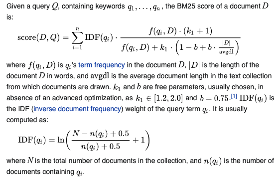
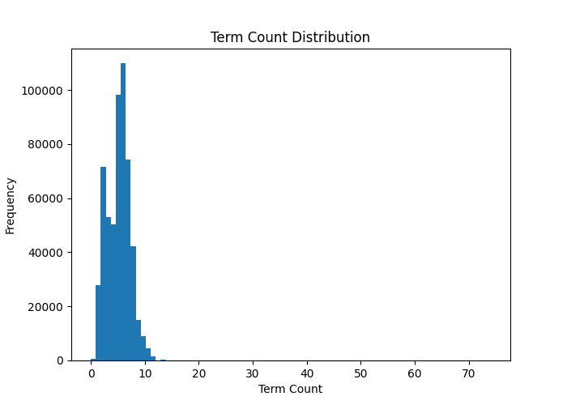
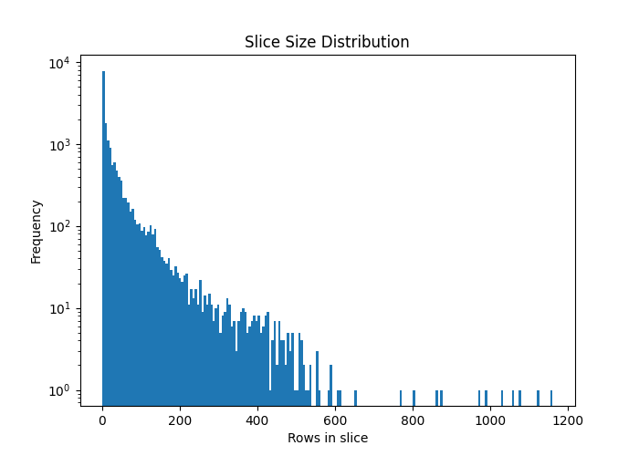

# akin

## Problem Statement
Movies are collected from different data providers. Data providers don't always use the same information to describe
the same movie. For example, the list of actors may be incomplete. The director may be missing.
The movie length may change slightly. The release year may vary according to the region.

A movie has the following attributes:
- id : unique in the provided list
- year: release year
- length: running duration in minutes
- genre: zero, one or many categories
- actors: zero, one or many actors
- directors: zero, one or many directors

For two entries describing the same movie, it's possible to have the following differences:
- id: each id is unique
- year: 1 year more or less at maximum
- length: 5% more or less at maximum, 2 * |x - y|/(x + y) <= 0.05 where x and y is the provided movie length
- genre: different order, or missing one or many genres
- actors: different order, or missing one or many actors
- directors: different order, or missing one or many directors

Given a list of movies where each movie is described by two different providers, the task is to 
identify the duplications. In other words, finding the **most similar row pairs**.

## Implementation Notes

- At the core of the similarity ranking is the [BM25](https://en.wikipedia.org/wiki/Okapi_BM25) algorithm which given a set of documents and a search query, scores a given document, such that higher scores are for better matches.
  
- There is a slight modification to the algorithm mentioned above, in the term frequency calculation. The dataset did not seem to have duplicate terms in one row, hence the term frequency is fixed to be 1 or 0.
- The reason for using BM25 and not something simpler like the [TF-IDF](https://en.wikipedia.org/wiki/Tf–idf) algorithm is because BM25 takes into account multiple words in the query, which the simple TF-IDF algorithm does not. Moreover, the computed score takes into consideration the average document length, which works well in our case since the number of terms (genres, directors, actors) have a unimodal central tendency:
  
- To simplify scoring rows, genres, directors and actors were merged into one set of lower-cased, ASCII-folded terms.
- To find the current row's best match, we take the current row's terms as the query and find the row that has the highest score. This is an O(N) operation for finding one row's match. 
- Since the number of rows is large and we need to find every row's best match, doing this iteratively is expensive. To speed this up, we partition the rows into "slices", each slice is a combination of `movieYear` and `movieLength`. The slice with the largest number of rows is in the 1000s.
  
- As given in the problem statement, a duplicate for a row exists only in slices with +/- 1 year and +/- 5% variance from the length. Having a partitioned row set enables us to read only ~5 slices (ie ~5K rows) for matching each row, instead of 500K rows, reducing the time to compute the final result to [under 5 mins](#runing-the-jar).   

## Result
The computed result is present [here](src/main/dev_resources/dedup-2020/matches.tsv). A match between r1 and r2 is present only once in the file. So the output file size is half of the input size.

Note: A few rows (110) could not be matched. This is mostly due to odd number of rows in some slices.

### Compiling 
Maven and Java need to be installed to compile and run this, this was built using:
- Apache Maven 3.8.1
- Java 16.0.1, supported language version: Java 11

### Building the Jar
```shell
mvn package
```

### Runing the Jar
```shell
java -cp target/akin-1.0-SNAPSHOT.jar me.mourjo.Launcher
```

Expected runtime: ~245 sec (as sampled on a 2019 Macbook Pro).